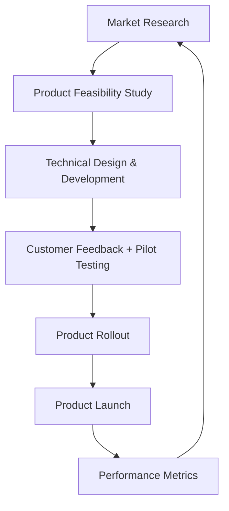
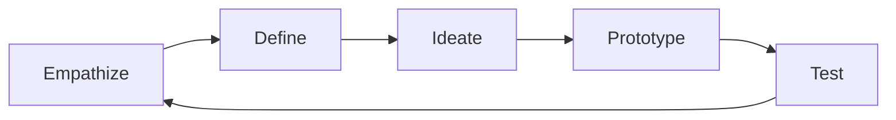
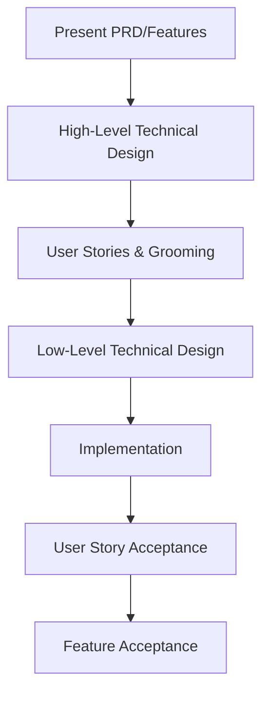

# 🚀 The Complete Product Manager Guide

*A comprehensive resource for Product Management concepts, processes, and best practices*

---

## 📊 Table of Contents

- [Product Manager Roles](#-product-manager-roles)
- [Understanding Products](#-understanding-products)
- [Product Development Process](#-product-development-process)
- [Essential Skills](#-essential-skills)
- [Roles & Responsibilities](#-roles--responsibilities)
- [PM vs Other Roles](#-pm-vs-other-roles)
- [Product Lifecycle](#-product-lifecycle)
- [Research Methods](#-research-methods)
- [Design Thinking](#-design-thinking)
- [Business Case Development](#-business-case-development)
- [Documentation](#-documentation)
- [Product Backlog Management](#-product-backlog-management)
- [Technical Design & Development](#-technical-design--development)
- [Customer Feedback](#-customer-feedback)
- [Product Launch](#-product-launch)
- [Metrics & Analytics](#-metrics--analytics)
- [Feature Writing](#-feature-writing)
- [Prioritization](#-prioritization)
- [Definition of Done](#-definition-of-done)
- [Strategic Elements](#-strategic-elements)
- [Best Practices](#-best-practices)

---

## 👨‍💼 Product Manager Roles

### Hierarchy Levels
- **Junior PM** - Entry-level product management
- **PM (Product Manager)** - Core product management role
- **Senior PM** - Experienced product leader
- **Principal PM** - Strategic product leadership

> 💡 **Key Insight**: A Product Manager is like a **mini CEO**, involved from planning to execution and deployment.

### Main Responsibility
**Product Development** encompasses:
- Market research and analysis
- Basic product design and conceptualization
- Requirements gathering and understanding

---

## 🎯 Understanding Products

### What is a Product?
A product is a comprehensive bundle of attributes that includes:

| Attribute | Description |
|-----------|-------------|
| **Functions** | Core capabilities and operations |
| **Features** | Specific functionalities and tools |
| **Benefits** | Value delivered to users |
| **Uses** | Application scenarios and use cases |

### Product Types
- **Tangible Products** - Physical items you can touch
- **Intangible Products** - Software, services, digital solutions

*This guide focuses primarily on **Software Products***

---

## 🔄 Product Development Process



### Detailed Breakdown

1. **Market Research** 🔍
   - Identify market opportunities
   - Analyze customer needs
   - Study competition

2. **Product Feasibility Study** 📋
   - Develop business case
   - Create feature backlog
   - Assess technical viability

3. **Technical Design & Development** 🛠️
   - Architecture planning
   - Implementation
   - Quality assurance

4. **Customer Feedback + Pilot Testing** 👥
   - Beta testing programs
   - User feedback collection
   - Iterative improvements

5. **Product Rollout** 📢
   - Staged deployment
   - Risk mitigation
   - Performance monitoring

6. **Product Launch** 🚀
   - Market introduction
   - Marketing campaigns
   - Sales enablement

7. **Performance Metrics** 📈
   - Success measurement
   - Data analysis
   - Continuous optimization

---

## 🎯 Essential Skills

### Core Skills (Must-Have)
| Skill | Importance | Application |
|-------|------------|-------------|
| **Communication** | ⭐⭐⭐⭐⭐ | Clear messaging across teams |
| **Client Handling** | ⭐⭐⭐⭐⭐ | Customer relationship management |
| **Negotiation** | ⭐⭐⭐⭐ | Stakeholder alignment |
| **Decision Making** | ⭐⭐⭐⭐⭐ | Strategic choices under uncertainty |
| **Coordination & Listening** | ⭐⭐⭐⭐ | Team collaboration |
| **Documentation** | ⭐⭐⭐⭐ | Clear requirement specification |
| **Assertiveness** | ⭐⭐⭐⭐ | Executive interaction (CEO, CTO, CMO) |

### Extra Skills (Nice-to-Have)
- **Business Understanding** - Market dynamics and revenue models
- **User Experience** - Design thinking and usability
- **Product Technology Knowledge** - Technical architecture awareness

> 🔑 **Key Advantage**: PM has **end-to-end access to the product** lifecycle

---

## 📋 Roles & Responsibilities

### Primary Responsibilities
- ✅ Define product vision, strategy & roadmap
- ✅ Create & prioritize feature backlog
- ✅ Run product demos (internal & end-users)
- ✅ Roll out features systematically
- ✅ Write functional release notes
- ✅ Collect and analyze customer feedback
- ✅ Drive cross-functional collaboration

---

## ⚖️ PM vs Other Roles

### Product Manager vs Project Manager

| Aspect | Product Manager | Project Manager |
|--------|----------------|----------------|
| **Focus** | Research & Vision | Planning & Execution |
| **Scope** | Customer requirements & market fit | Deliver requirements on time/budget |
| **Activities** | Create features & strategy | Develop & test features |
| **Coordination** | Customers, sales, marketing | PMs & stakeholders |
| **Success Metrics** | Define success metrics | Monitor progress & budget |
| **Documentation** | Write user manuals | Handle resource allocation |

### Product Manager vs Business Analyst

| Aspect | Product Manager | Business Analyst |
|--------|----------------|------------------|
| **Vision** | Vision & roadmap ownership | Gather detailed requirements |
| **Research** | Market research & strategy | Write BRD/FSD documentation |
| **Planning** | Feature backlog management | Use cases & detailed specifications |
| **Coordination** | Owners, architects, sales & marketing | Focused documentation efforts |
| **Client Management** | Direct client relationships | Limited client interaction |

> 📈 **Key Difference**: PMs have broader strategic responsibilities than BAs

---

## 🤔 Does a PM Need to Be Technical?

### The Answer: **Yes & No**

**✅ Advantages of Technical Knowledge:**
- Better communication with development teams
- More accurate estimation and feasibility assessment
- Enhanced problem-solving capabilities

**❌ Technical Knowledge Not Mandatory Because:**
- Strategic thinking is more important than coding
- Strong communication can bridge technical gaps
- Domain expertise often trumps technical skills

---

## 🔬 Product Lifecycle

### Research Process Flow
```
Market Research → Define Problem → Collect Data → Analyze Data → Conclude
```

#### Detailed Breakdown

1. **Define Problem** 🎯
   - Identify customer pain points
   - Clarify problem statements
   - Validate problem significance

2. **Collect Data** 📊
   
   **Primary Research:**
   - Surveys and questionnaires
   - Customer interviews
   - Focus groups
   
   **Secondary Research:**
   - Industry reports
   - Competitor analysis
   - Academic studies

3. **Analyze Data** 🔍
   - Interpret findings
   - Identify patterns and trends
   - Generate insights

4. **Conclude** ✅
   - Summarize key findings
   - Make data-driven decisions
   - Define next steps

---

## 🔬 Research Methods

### Primary Research Techniques

| Method | Description | Best For |
|--------|-------------|----------|
| **Focus Groups** | Moderated group discussions | Qualitative insights |
| **Surveys & Questionnaires** | Structured data collection | Quantitative validation |
| **Trials & Experiments** | Controlled testing | Hypothesis validation |

### Secondary Research Sources

**Internal Sources:**
- Sales records and performance data
- Profit & Loss statements
- Inventory and operational metrics

**External Sources:**
- Industry reports and publications
- Competitor research and analysis
- Academic projects and studies

---

## 💡 Design Thinking

### The Design Thinking Process



#### Stage Details

1. **Empathize** 🤝
   - Understand customer needs deeply
   - Conduct user research
   - Develop empathy maps

2. **Define** 🎯
   - Clarify customer needs and problems
   - Create problem statements
   - Define success criteria

3. **Ideate** 💭
   - Brainstorm multiple solutions
   - Think outside the box
   - Generate creative alternatives

4. **Prototype** 🛠️
   - Build sample models or mockups
   - Create testable versions
   - Develop MVPs

5. **Test** 🧪
   - Gather user feedback
   - Validate assumptions
   - Refine and iterate

---

## 📊 Business Case Development

### Executive Summary Components

| Section | Purpose | Key Elements |
|---------|---------|--------------|
| **Background** | Context setting | Problem/opportunity description |
| **Solutions** | Proposed approach | Alternative solutions and recommendations |
| **Resources & Cost** | Investment requirements | Budget, timeline, resources needed |
| **Benefits & Value** | Expected returns | ROI, strategic value, competitive advantage |
| **Risks** | Risk assessment | Potential challenges and mitigation |
| **Recommended Action** | Clear direction | Next steps and decision points |
| **ROI** | Financial justification | Return on investment calculations |

### Detailed Business Case Structure

1. **Executive Summary** - High-level overview
2. **SWOT Analysis** - Strengths, Weaknesses, Opportunities, Threats
3. **Business Objectives** - Clear goal definition
4. **Cost-Benefit Analysis** - Financial evaluation
5. **Market Assessment** - Market opportunity and sizing
6. **Risk Assessment** - Risk identification and mitigation
7. **Recommendations** - Actionable next steps
8. **Plan Outline** - Implementation roadmap
9. **Scope & Dependencies** - Project boundaries and requirements
10. **Reporting** - Success metrics and tracking

---

## 📄 Documentation

### MRD vs PRD

| Document | Full Name | Focus | Owner |
|----------|-----------|-------|-------|
| **MRD** | Market Requirement Document | Customer needs and market demands | Product Manager |
| **PRD** | Product Requirement Document | Product specifications and value proposition | Product Manager |

> ✅ **Important**: Both documents are prepared by the PM and require stakeholder sign-off before development begins.

---

## 🗂️ Product Backlog Management

### Hierarchy Structure

```
                    THEME (Strategic Objective)
                       |
                    EPIC (Large Body of Work) ← Product Manager
                       |
                    FEATURE (Deliverable Capability)
        ________________________________________________
        |                    |                         |
     STORY               SPIKE                        NFR ← Product Owner
   (User Need)      (Research Task)         (Non-Functional Req)
        |                    |                         |
     TASK                 TASK                      TASK ← Team Members
```

#### Definitions

- **Theme** → High-level strategic objective
- **Epic** → Large body of work spanning multiple sprints
- **Feature** → Deliverable capability that provides value
- **Story** → User-centric requirement with clear acceptance criteria
- **Spike** → Research or investigation task
- **NFR** → Non-functional requirements (performance, security, scalability)
- **Task** → Smallest actionable work item

---

## ⚙️ Technical Design & Development

### Development Flow



#### Detailed Process

1. **Present PRD/Features** → Architects + PO + Tech Lead
2. **High-Level Technical Design** → Architects
3. **User Stories & Grooming** → PO + Development Team
4. **Low-Level Technical Design** → Team Members
5. **Implementation** → Developers & Testers
6. **User Story Acceptance** → Product Owner
7. **Feature Acceptance** → Product Manager

---

## 👥 Customer Feedback

### Feedback Collection Process

1. **Develop MVP** 🏗️
   - Create minimum viable product
   - Focus on core functionality
   - Ensure basic user experience

2. **Share with Selected Customers** 👥
   - Choose representative user groups
   - Provide clear instructions
   - Set expectations for feedback

3. **Collect Feedback** 📝
   - Use multiple channels (surveys, interviews, analytics)
   - Document all input systematically
   - Categorize feedback by themes

4. **Prioritize Changes** 🎯
   - Focus on user experience improvements
   - Balance effort vs impact
   - Align with product strategy

---

## 🚀 Product Launch

### Launch Process

1. **Pilot with First Customer** 🧪
   - Limited release to trusted customers
   - Close monitoring and support
   - Rapid issue resolution

2. **Fix Critical Issues** 🛠️
   - Address high/medium severity issues
   - Validate fixes with pilot customers
   - Update documentation

3. **Broad Launch** 📢
   - Full market release
   - Marketing campaign activation
   - Sales team enablement

### Key Metrics to Track

| Metric | Purpose | Target |
|--------|---------|---------|
| **CSAT** | Customer Satisfaction Score | > 4.0/5.0 |
| **NPS** | Net Promoter Score | > 50 |
| **Adoption Rate** | New user uptake | Varies by product |
| **Churn Rate** | Customer retention | < 5% monthly |
| **Feature Usage** | Engagement tracking | > 60% adoption |
| **Support Tickets** | Issue volume | Decreasing trend |
| **Time to Resolution** | Support efficiency | < 24 hours |

---

## 📈 Metrics & Analytics

### Core Metrics

#### Customer Satisfaction Metrics
- **CSAT** - Customer Satisfaction Score (1-5 or 1-10 scale)
- **NPS** - Net Promoter Score (likelihood to recommend)
- **Customer Effort Score** - Ease of product usage

#### Business Metrics
- **Adoption Rate** - New user acquisition and onboarding
- **Retention Rate** - Customer loyalty over time
- **Cohort Analysis** - User behavior patterns by group
- **Conversion Rate** - Funnel optimization metrics
- **Revenue Impact** - Financial performance indicators
- **ROI** - Return on investment for product initiatives

#### Product Usage Metrics
- **Feature Usage** - Individual feature adoption
- **Engagement Metrics** - User activity and interaction
- **User Journey Analytics** - Path analysis and drop-offs
- **Performance Metrics** - Speed, reliability, availability

---

## ✍️ Feature Writing

### INVEST Model for User Stories

| Criterion | Description | Example |
|-----------|-------------|---------|
| **Independent** | Can be developed separately | Story doesn't depend on another |
| **Negotiable** | Details can be discussed | Requirements are flexible |
| **Valuable** | Provides clear user value | Solves a real user problem |
| **Estimable** | Can be sized by the team | Clear enough to estimate effort |
| **Small** | Fits within a sprint | Completable in 1-2 weeks |
| **Testable** | Has clear acceptance criteria | Can verify when done |

### User Story Template

```
As a [user/persona],
I want [feature/capability],
So that [benefit/value].

Acceptance Criteria:
- [ ] Criterion 1
- [ ] Criterion 2
- [ ] Criterion 3
```

---

## 🎯 Prioritization

### WSJF (Weighted Shortest Job First)

```
WSJF = (User Value + Time Value + RR|OE) / Job Size
```

Where:
- **User Value** - Benefit to users and customers
- **Time Value** - Urgency and time-sensitive nature
- **RR|OE** - Risk Reduction & Opportunity Enablement
- **Job Size** - Effort required for implementation

### Other Prioritization Methods

- **MoSCoW** - Must have, Should have, Could have, Won't have
- **Value vs Effort Matrix** - Plot features on impact/effort grid
- **Kano Model** - Basic, Performance, Excitement features
- **ICE Score** - Impact, Confidence, Ease

---

## ✅ Definition of Done

### Feature Definition of Done

- [ ] All related stories completed & accepted
- [ ] End-to-end functionality working as expected
- [ ] Comprehensive testing completed (unit, integration, regression)
- [ ] Documentation updated (user guides, technical docs)
- [ ] Code reviewed and approved by stakeholders
- [ ] Performance and security requirements met
- [ ] Ready for production release

### Story Definition of Done

- [ ] Code written and peer-reviewed
- [ ] Unit tests written and passing
- [ ] Acceptance criteria fully met
- [ ] Functionality tested by QA
- [ ] No high-severity bugs remaining
- [ ] Product Owner reviewed & accepted
- [ ] Demo-ready for stakeholders

---

## 🎯 Strategic Elements

### Product Strategy Components

#### Vision & Mission
- **Vision** - Long-term aspirational goal
- **Mission** - Core purpose and value proposition
- **Values** - Guiding principles and beliefs

#### Go-to-Market Strategy
- **Target Market** - Customer segments and personas
- **Value Proposition** - Unique selling points
- **Pricing Strategy** - Revenue model and pricing tiers
- **Distribution Channels** - How customers access the product
- **Marketing Strategy** - Brand positioning and messaging

#### Competitive Analysis
- **Direct Competitors** - Similar products and services
- **Indirect Competitors** - Alternative solutions
- **SWOT Analysis** - Strengths, weaknesses, opportunities, threats
- **Competitive Advantage** - Unique differentiators

#### Product Roadmap Planning
- **Short-term Goals** (0-3 months)
- **Medium-term Objectives** (3-12 months)
- **Long-term Vision** (1-3 years)
- **Dependencies** - Technical and business dependencies
- **Resource Allocation** - Team and budget planning

---

## 🛡️ Risk & Stakeholder Management

### Risk Management
- **Risk Identification** - Proactive risk assessment
- **Risk Analysis** - Impact and probability evaluation
- **Mitigation Plans** - Preventive and corrective actions
- **Contingency Planning** - Backup strategies

### Stakeholder Management
- **Stakeholder Mapping** - Identify all stakeholders
- **Communication Plans** - Regular updates and reporting
- **Expectation Management** - Clear goal setting
- **Conflict Resolution** - Addressing disagreements

### Compliance Considerations
- **GDPR** - Data privacy regulations
- **HIPAA** - Healthcare information protection
- **PCI** - Payment card industry standards
- **SOX** - Financial reporting compliance

---

## 🔄 Continuous Improvement

### Improvement Practices

#### Retrospectives
- **Sprint Retrospectives** - Regular team reflection
- **Release Retrospectives** - Post-launch analysis
- **Quarterly Reviews** - Strategic assessment
- **Annual Planning** - Long-term strategy adjustment

#### Process Optimization
- **Bottleneck Identification** - Find process constraints
- **Workflow Improvement** - Streamline operations
- **Tool Evaluation** - Assess and upgrade tools
- **Automation Opportunities** - Reduce manual work

#### Quality Enhancement
- **Customer Feedback Integration** - Continuous user input
- **Data-Driven Decisions** - Use metrics for improvement
- **Best Practice Sharing** - Cross-team knowledge transfer
- **Training and Development** - Team skill enhancement

---

## 🎯 Best Practices

### Golden Rules for Product Managers

#### 🎯 Customer-Centric Thinking
- Always think from the customer perspective
- Validate assumptions with real user data
- Prioritize user experience over internal preferences

#### 📊 Value-Driven Approach
- Focus on **value delivery**, not just feature quantity
- Measure success through customer outcomes
- Balance short-term gains with long-term vision

#### 💬 Clear Communication
- Communicate clearly and frequently
- Use data to support your arguments
- Tailor messaging to your audience

#### 📈 Data-Driven Prioritization
- Use quantitative and qualitative data
- Validate decisions with A/B testing
- Track metrics that matter to business goals

#### 🔄 Continuous Iteration
- Embrace an iterative approach
- Learn from failures quickly
- Continuously gather and act on feedback

#### ⚖️ Balanced Decision Making
- Balance feasibility, impact, and user experience
- Consider technical constraints early
- Make trade-offs transparently

#### 📝 Documentation Excellence
- Document everything important
- Keep documentation current and accessible
- Use visuals to enhance understanding

---

## 🚀 Final Thoughts

Product Management is a dynamic and challenging role that requires a unique blend of strategic thinking, technical understanding, and interpersonal skills. Success comes from:

- **Staying Customer-Focused** - Never lose sight of who you're building for
- **Being Data-Driven** - Let evidence guide your decisions
- **Communicating Effectively** - Bridge gaps between teams and stakeholders  
- **Embracing Change** - Adapt quickly to market and customer needs
- **Continuous Learning** - Stay updated with industry trends and best practices

> 💡 **Remember**: Great products are built by great teams. Your role as a PM is to enable, guide, and inspire that team to create exceptional value for customers.

---

*This guide serves as a comprehensive reference for Product Managers at all levels. Bookmark it, share it, and most importantly - apply these concepts to build amazing products!*
